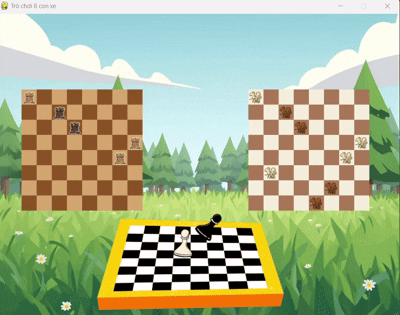

# Đồ án Trí tuệ Nhân tạo: Bài toán 8 quân xe

Đề tài thực hiện bài toán sắp xếp 8 quân xe trên bàn cờ sao cho không quân nào ăn nhau, kết hợp triển khai và so sánh các thuật toán tìm kiếm trong AI.

---

## I. Thuật toán Tìm kiếm Mù (Uninformed Search)

### 1. Thuật toán BFS
1.  **Khởi tạo chương trình:**
    * Gọi `__start_BFS__`. Khởi tạo Pygame (cửa sổ 800×600), surfaces (`panel`, `panel_1`), âm thanh và ảnh nền.
    * Tạo ma trận trống `__mang_2D__` và trạng thái khởi điểm `__mang__`.
2.  **Sinh cấu hình đích (mẫu cần tìm):**
    * Chọn ngẫu nhiên một ô `(x,y)` đặt quân đầu tiên, gọi `__chieu_xe__` để đánh dấu ô bị chiếu.
    * Dùng `__de_xe__` (đệ quy) sinh các đặt thử để thu một cấu hình đích có 8 quân xe.
    * Gọi `__xu_ly_sau_khi_sinh_mang_2D__` để chuẩn hóa ma trận (chỉ giữ 0/1).
3.  **Thiết lập hàng đợi & visited:**
    * `__BFS__` khởi tạo `hang_doi = deque()` chứa trạng thái bắt đầu (`__mang__`) và `visited` lưu `tobytes()` của trạng thái để tránh lặp.
4.  **Mở rộng theo BFS:**
    * Lặp: `popleft()` một trạng thái `Ma_tran_hien_tai`. Nếu trùng `Ma_Tran_Dich` → trả về kết quả.
    * Xác định hàng `t` (hàng đầu tiên chưa có quân).
    * Gọi `__Ma_Tran_Ke_Tiep_BFS_1__` để sinh mọi ma trận con hợp lệ bằng cách đặt một quân ở mỗi cột `j` chưa có quân; nếu trạng thái mới chưa visited thì `append` vào `hang_doi` và lưu parent vào `__Cau_hinh__`.
5.  **Truy vết kết quả:**
    * Khi tìm được ma trận đích, `__xu_ly_cau_hinh__` dùng `Cau_hinh` để duyệt ngược từ trạng thái đích về trạng thái gốc để trả về danh sách cấu hình trung gian.
6.  **Hiển thị bằng Pygame:**
    * Vòng lặp hiển thị: vẽ nền, vẽ trạng thái đích (`__ve_8_con_xe__`) và tuần tự các cấu hình trung gian (`__ve_co_trong__`).
    * Phát âm thanh `tieng_co.mp3` mỗi bước, delay giữa các bước để quan sát tiến trình.
    

### 2. Thuật toán DFS (Depth-First Search)
1.  **Khởi tạo chương trình:**
    * Gọi `__start_DFS__`. Khởi tạo Pygame, cửa sổ, surfaces, font và âm thanh.
    * Tạo ma trận trống `__mang_2D__` và trạng thái bắt đầu `__mang__`.
2.  **Sinh cấu hình đích mẫu:**
    * Chọn ngẫu nhiên ô `(x, y)` đặt quân đầu tiên, gọi `__chieu_xe__` và `__de_xe__` để thu một cấu hình đích.
    * Gọi `__xu_ly_sau_khi_sinh_mang_2D__` để chuẩn hóa ma trận.
3.  **Chuẩn bị DFS:**
    * Tạo `stack` và push trạng thái khởi điểm, tạo tập `visited` để tránh lặp.
    * `Cau_hinh` dùng để lưu parent cho từng trạng thái.
4.  **Mở rộng trạng thái (DFS):**
    * Lặp cho đến khi stack rỗng: pop trạng thái cuối cùng. Nếu trùng đích → trả về.
    * Tìm hàng `t` đầu tiên chưa có quân.
    * Gọi `__Ma_Tran_Ke_Tiep_DFS_1__` để sinh các trạng thái con.
    * Nếu trạng thái con hợp lệ và chưa được thăm, push vào stack và lưu parent.
5.  **Truy vết & hiển thị:**
    * Khi tìm được đích, `__xu_ly_cau_hinh__` duyệt ngược `Cau_hinh` để thu danh sách các cấu hình trung gian.
    * Vòng lặp Pygame hiển thị lần lượt các bước qua `__ve_co_trong__`, phát âm thanh và delay.
6.  **Kết thúc:**
    * Nếu tìm được cấu hình hoàn chỉnh thì hiển thị kết quả cuối. Nếu stack rỗng mà chưa tìm được, trả về None.
     

### 3. Thuật toán IDS (Iterative Deepening Search)
1.  **Khởi tạo:**
    * Chạy `__start_IDS__`: khởi tạo Pygame, cửa sổ, âm thanh, ảnh.
    * Tạo ma trận đích `__mang_2D__` bằng `__de_xe__` rồi chuẩn hoá.
2.  **Iterative Deepening (IDS):**
    * Gọi `__IDS__`: bắt đầu với `depth = 0` và lặp: gọi `__DLS__` với `limit = depth`.
    * Tăng `depth` dần nếu `DLS` trả về `"cutoff"`.
3.  **Depth-Limited Search (DLS):**
    * `__DLS__` gọi `__RECURSIVE_DLS__` thực hiện đệ quy có giới hạn.
    * Nếu `limit == 0` trả về `"cutoff"`.
    * Ngược lại, sinh các trạng thái con và gọi đệ quy với `limit - 1`.
4.  **Truy vết & chuẩn bị hiển thị:**
    * Khi `IDS` trả về trạng thái đích, dùng `__xu_ly_cau_hinh__` để duyệt ngược `Cau_hinh` thu danh sách các cấu hình trung gian.
5.  **Hiển thị bằng Pygame:**
    * Lặp vẽ nền, vẽ trạng thái đích và tuần tự các cấu hình trung gian.
    * Phát âm thanh cho mỗi bước, delay để người xem theo dõi.
     

### 4. Thuật toán DLS (Depth-Limited Search)
1.  **Khởi tạo chương trình:**
    * Gọi `__start_DLS__`. Khởi tạo Pygame, cửa sổ, surfaces, âm thanh, ảnh nền.
    * Tạo ma trận trống `__mang__` và sinh mẫu đích `__mang_2D__`.
2.  **Chuẩn bị DLS:**
    * `__DLS__` gọi `__RECURSIVE_DLS__` với `limit = 8`.
    * `Cau_hinh` là dictionary lưu metadata mỗi trạng thái (parent, dtype, shape).
3.  **Đệ quy có giới hạn (`__RECURSIVE_DLS__`):**
    * Nếu `Ma_Tran` trùng `Ma_Tran_Dich` → trả về trạng thái (thành công).
    * Nếu `limit == 0` → trả về `"cutoff"`.
    * Ngược lại: xác định hàng `t` chưa có quân.
    * Với mỗi cột `j` hợp lệ: tạo trạng thái con, lưu parent, rồi gọi đệ quy với `limit - 1`.
    * Xử lý kết quả đệ quy: nếu có `"cutoff"` thì đánh dấu, nếu có nghiệm thì trả về nghiệm đó.
4.  **Xử lý kết quả:**
    * Nếu `DLS` trả về trạng thái thực, dùng `__xu_ly_cau_hinh__` để truy ngược `Cau_hinh` thu danh sách các cấu hình trung gian.
    * Nếu nhận `"cutoff"` hoặc `None`, tạo danh sách hiển thị mặc định.
5.  **Hiển thị bằng Pygame:**
    * Duyệt danh sách cấu hình trung gian: gọi `__ve_co_trong__` cho từng bước, phát âm thanh và delay.
    
### 5. Thuật toán UCS (Uniform Cost Search)
1.  **Khởi tạo chương trình:**
    * Gọi `__start_UCS__`: khởi tạo Pygame, cửa sổ, font và âm thanh.
    * Tạo ma trận đích `__mang_2D__` bằng `__de_xe__` và chuẩn hóa.
2.  **Chuẩn bị hàng ưu tiên:**
    * Tạo heap `hang_doi`, đẩy trạng thái bắt đầu với chi phí 0.
    * `visited` lưu các trạng thái đã thăm, `Cau_hinh` lưu parent và chi phí.
3.  **Vòng lặp UCS:**
    * Lặp: `heappop` trạng thái có `chi_phi` nhỏ nhất. Nếu là đích → trả kết quả.
    * Xác định hàng `t` đầu tiên chưa có quân.
    * Gọi `__Ma_Tran_Ke_Tiep_UCS_1__` để sinh các trạng thái con, tính chi phí mới (`chi_phi_hien_tai + 1`).
    * Nếu trạng thái con chưa được thăm, đẩy vào heap, đánh dấu visited và lưu parent.
4.  **Truy vết & hiển thị kết quả:**
    * Khi tìm được đích, `__xu_ly_cau_hinh__` dùng `Cau_hinh` để duyệt ngược và tạo danh sách các cấu hình trung gian.
    * Vòng lặp Pygame hiển thị lần lượt các bước và chi phí trên màn hình.
    
---

### 6. Thuật toán Greedy (Best-first theo heuristic)
1.  **Khởi tạo chương trình:**
    * Khởi tạo Pygame, cửa sổ, font, âm thanh.
    * Tạo ma trận đích `__mang_2D__` bằng cách gọi `__de_xe__` và chuẩn hóa.
    * Lưu danh sách tọa độ quân đích vào `__li__`.
2.  **Chuẩn bị heap:**
    * Tạo heap `hang_doi`, đẩy trạng thái khởi điểm vào.
3.  **Mở rộng trạng thái (vòng lặp Greedy):**
    * Lặp: `heappop` trạng thái có heuristic (`h`) nhỏ nhất. Nếu bằng đích → thành công.
    * Tìm hàng `t` đầu tiên chưa có quân.
    * Gọi `__Ma_Tran_Ke_Tiep_Greedy_1__` để sinh trạng thái con.
    * Với mỗi trạng thái con, tính heuristic và đẩy vào heap, đồng thời lưu parent vào `__Cau_hinh__`.
4.  **Truy vết & hiển thị:**
    * Khi tìm được đích, dùng `__xu_ly_cau_hinh__` để duyệt ngược `Cau_hinh` và thu danh sách các cấu hình trung gian.
    * Vòng lặp Pygame hiển thị tuần tự các cấu hình, phát âm thanh và in `chi_phi` mỗi bước.
5.  **Kết thúc:**
    * Nếu tìm được, hiển thị cấu hình cuối. Nếu heap rỗng, trả về `None`.
    
### 7. Thuật toán A*
1.  **Khởi tạo chương trình:**
    * Gọi `__start_A_sao__`. Khởi tạo Pygame, cửa sổ 800×600, surfaces (`panel`, `panel_1`), font và âm thanh (`tieng_co.mp3`).
    * Tạo ma trận trống `__mang_2D__` (8×8) và ma trận `__mang__` làm trạng thái khởi điểm.
2.  **Sinh cấu hình đích ban đầu:**
    * Chọn ngẫu nhiên ô `(x,y)` đặt quân đầu tiên, gọi `__chieu_xe__` để đánh dấu ô bị chiếu.
    * Gọi đệ quy `__de_xe__` để thử đặt các quân còn lại (tạm đánh dấu vùng bị chiếu).
    * Sau khi sinh, gọi `__xu_ly_sau_khi_sinh_mang_2D__` để chuyển ma trận về chỉ chứa 0/1 và lưu danh sách tọa độ `__li__`.
3.  **Chuẩn bị A\*:**
    * Khởi tạo heap `hang_doi` chứa tuple `(f, counter, state)`. Đánh dấu khởi điểm `Trang_Thai_Mang` đã `visited`.
    * `__Cau_hinh__` dùng để lưu metadata mỗi trạng thái (parent, chi phí, thành phần f/g/h).
4.  **Mở rộng trạng thái (hàm A\*):**
    * Lặp: pop trạng thái có `f` nhỏ nhất từ heap. Nếu trạng thái bằng `Ma_Tran_Dich` (ma trận đích `__mang_2D__`) → trả về.
    * Xác định hàng `t` cần đặt tiếp: tìm hàng đầu tiên (từ trên xuống) chưa có quân trong `Ma_tran_hien_tai`.
    * Tính `chi_phi` (g) bằng cách trừ heuristic của bước trước nếu có; gọi `__Ma_Tran_Ke_Tiep_A_sao_1__` để sinh các ma trận con.
5.  **Lưu cấu hình & truy vết:**
    * Khi tìm được trạng thái đích, dùng `__xu_ly_cau_hinh__` duyệt ngược `Cau_hinh` từ ma trận đích để thu được danh sách các cấu hình trung gian và các giá trị chi phí (f/g/h).
6.  **Hiển thị bằng Pygame:**
    * Vòng lặp chính Pygame: hiển thị nền, vẽ trạng thái đích (`__ve_8_con_xe__`) và lần lượt các cấu hình trung gian (`__ve_co_trong__`).
    * Ở mỗi bước phát âm thanh (`tieng_co.mp3`) và hiển thị chuỗi chi phí (`f g h`) lên màn hình, delay giữa các bước để quan sát.
    
### 8. Thuật toán AND–OR Graph Search
1.  **Khởi tạo:**
    * Hàm `__AND_OR_Search__` chạy đầu tiên, khởi tạo Pygame, cửa sổ, bảng cờ 8×8.
    * Nạp hình ảnh, âm thanh và tạo ma trận trống `__mang_2D__`.
2.  **Sinh cấu hình ban đầu:**
    * Chọn ngẫu nhiên vị trí `(x, y)` để đặt xe đầu tiên.
    * `__chieu_xe__` đánh dấu ô bị chiếu, `__de_xe__` đặt tiếp 8 quân xe hợp lệ bằng đệ quy.
3.  **Xử lý ma trận:**
    * `__xu_ly_sau_khi_sinh_mang_2D__` làm sạch ma trận, chỉ giữ lại các vị trí xe.
    * Lưu danh sách tọa độ `__li__` để tính heuristic.
4.  **Tìm kiếm AND–OR:**
    * `__AND_OR_GRAPH_SEARCH__` bắt đầu từ ma trận rỗng đến trạng thái đích `__mang_2D__`.
    * `__OR_SEARCH__` chọn hàng/cột hợp lệ và sinh trạng thái mới bằng `__sinh__`.
    * `__AND_SEARCH__` kiểm tra hợp lệ của toàn bộ nhánh con.
    * Cấu hình và chi phí được lưu trong `__Cau_hinh__`.
5.  **Truy vết & hiển thị:**
    * `__xu_ly_cau_hinh__` truy vết lại các bước trung gian.
    * Vòng lặp chính Pygame hiển thị từng cấu hình bằng `__ve_co_trong__`, kèm âm thanh `tieng_co.mp3`.
6.  **Kết thúc:**
    * Khi đủ 8 quân xe hợp lệ, hiển thị cấu hình cuối cùng và dừng chương trình.

### 9. Thuật toán Hill Climbing (Beam Search)
1.  **Khởi tạo:**
    * Hàm `__hill_clambing_Search__` khởi chạy, tạo cửa sổ Pygame, bảng cờ, font và âm thanh.
    * Tạo ma trận trống `__mang_2D__` (bàn cờ 8×8).
2.  **Sinh cấu hình ban đầu:**
    * Chọn ngẫu nhiên một ô `(x, y)` để đặt quân xe đầu tiên.
    * `__chieu_xe__` đánh dấu vùng bị chiếu, `__de_xe__` đệ quy đặt thêm các quân hợp lệ.
3.  **Xử lý dữ liệu:**
    * `__xu_ly_sau_khi_sinh_mang_2D__` lọc giữ lại vị trí hợp lệ, lưu danh sách tọa độ `__li__`.
4.  **Tìm kiếm bằng Hill Climbing (Beam):**
    * `__beam__` bắt đầu từ ma trận trống đến ma trận đích `__mang_2D__`.
    * Trong mỗi vòng lặp:
        * Chọn tối đa `beam_width` trạng thái tốt nhất (theo heuristic).
        * Sinh các ma trận con bằng `__Ma_Tran_Ke_Tiep_beam__` và đẩy vào hàng đợi.
        * Dừng khi tìm thấy cấu hình trùng với trạng thái đích.
    * Toàn bộ cấu hình và chi phí được lưu vào `__Cau_hinh__`.
5.  **Truy vết & hiển thị:**
    * `__xu_ly_cau_hinh__` tạo danh sách các cấu hình và chi phí tương ứng.
    * Vòng lặp Pygame hiển thị từng bước đặt quân bằng `__ve_co_trong__`, phát âm thanh `tieng_co.mp3`, và in chi phí.
6.  **Kết thúc:**
    * Khi đạt cấu hình có 8 quân xe hợp lệ, chương trình dừng và hiển thị kết quả cuối cùng.

### 10. Hill Climbing (phiên bản heap/greedy)
1.  **Khởi tạo chương trình:**
    * Gọi `__hill_clambing_Search__`. Khởi tạo Pygame, tạo cửa sổ 800×600, surfaces (`panel`, `panel_1`), font và âm thanh (`tieng_co.mp3`).
    * Khởi tạo `N = 8`, tạo `__mang_2D__` (ma trận đích) và `__mang__` (trạng thái khởi điểm rỗng).
2.  **Sinh mẫu đích:**
    * Chọn ngẫu nhiên một ô `(x,y)`, đặt `1`, gọi `__chieu_xe__` để đánh dấu vùng bị chiếu và gọi đệ quy `__de_xe__` để cố gắng đặt các quân còn lại.
    * Sau khi sinh, `__xu_ly_sau_khi_sinh_mang_2D__` chuẩn hóa ma trận chỉ còn 0/1 và lưu danh sách tọa độ `__li__` (dùng trong heuristic).
3.  **Chuẩn bị heap & biến đếm:**
    * Dùng `heapq` làm hàng ưu tiên; `__lan_vo__` là counter để tránh so sánh trực tiếp numpy arrays.
    * Đẩy trạng thái khởi điểm vào heap với key lớn khởi tạo (1000).
4.  **Vòng lặp hill-climbing (hàm `__hill_clambing__`)**
    * Pop trạng thái có `chi_phi` nhỏ nhất từ heap → `Ma_tran_hien_tai`. Nếu trùng `__mang_2D__` → trả về (thành công).
    * Tìm hàng `t` đầu tiên chưa có quân trong `Ma_tran_hien_tai`.
    * **TẠO HEROIC NEIGHBORS:** gọi `__Ma_Tran_Ke_Tiep_hill_clambing__` với tham số `chi_phi` hiện tại:
        * Với mỗi cột `j` trống, tạo `Ma_Tran_Tam_Thoi` có thêm quân ở `(t,j)` và tính `chi_phi_1 = __ham_tinh_heuristic__(t,j,li)`.
        * **Lọc hill:** chỉ push vào heap những trạng thái con có `chi_phi_1 <= chi_phi` (chỉ tìm trạng thái tốt hơn hoặc bằng).
        * Lưu metadata parent và `chi_phi_1` vào `__Cau_hinh__`.
    * Lặp tới khi heap rỗng (không tìm được trạng thái tốt hơn) hoặc tìm thấy ma trận đích.
5.  **Truy vết & hiển thị:**
    * Khi đạt trạng thái đích, `__xu_ly_cau_hinh__` duyệt ngược `__Cau_hinh__` dựa trên key `tobytes()` để tạo danh sách cấu hình trung gian và danh sách `tong_chi_phi`.
    * Vòng lặp Pygame hiển thị lần lượt từng cấu hình qua `__ve_co_trong__`, phát âm thanh và hiển thị giá trị `chi_phi` mỗi bước (delay để quan sát).

### 11. Simulated Annealing
1.  **Khởi tạo & sinh mẫu đích:**
    * Gọi `__hill_clambing_Search__`. Khởi tạo Pygame, tạo cửa sổ (800×600), load ảnh/âm thanh, khởi tạo `N = 8`.
    * Sinh ma trận đích `__mang_2D__`: chọn một ô ngẫu nhiên, đặt 1, gọi `__chieu_xe__` và `__de_xe__` (đệ quy) để đặt các quân còn lại; sau đó chuẩn hóa (chỉ giữ 0/1) và lưu tọa độ quân vào `li`.
2.  **Định nghĩa heuristic:**
    * `__ham_tinh_heuristic__(hang, j, li)` trả `chi_phi` (ở code bắt đầu từ 1 và cộng khoảng cách cột tới các quân trong `li` cùng hàng). Đây là giá trị càng nhỏ càng tốt.
3.  **Nhiệt độ & schedule:**
    * `__Tinh_T__(t)` trả nhiệt độ tại bước `t`: trong code `T = 1000 / (1 + t)` (giảm dần về 0 khi t tăng).
4.  **Sinh và chọn láng giềng:**
    * `__Ma_Tran_Ke_Tiep_simulated_Annealing__(Ma_Tran_Hien_Tai, hang_doi, cau_hinh)` sinh **toàn bộ** các trạng thái láng giềng khả dĩ bằng cách thử đặt 1 vào mọi ô `(hang, j)` chưa có quân, tính `chi_phi_1` cho mỗi láng giềng, đẩy vào heap theo `chi_phi_1` và lưu parent + chi_phi vào `Cau_hinh`. Hàm trả láng giềng tốt nhất bằng `heappop` (chi phí nhỏ nhất).
5.  **Vòng lặp Simulated Annealing:**
    * `__Simulated_Annealing__(Ma_Tran_Dich, Trang_Thai_Mang, cau_hinh)` khởi tạo trạng thái hiện tại bằng trạng thái bắt đầu, lấy `chi_phi` tương ứng.
    * Lặp `t` từ 0 tới tối đa (code: `t < 1000`):
        * Nếu trạng thái hiện tại trùng `Ma_Tran_Dich` → trả về (thành công).
        * Tính `T = __Tinh_T__(t)`; nếu `T < 0` dừng.
        * Gọi `__Ma_Tran_Ke_Tiep_simulated_Annealing__` để lấy láng giềng tốt nhất `(chi_phi_new, _, ma_tran_new)`.
        * Nếu không có láng giềng → trả về `None`.
        * Nếu `chi_phi_new <= chi_phi` → nhận láng giềng (cập nhật `Ma_tran_hien_tai`, `chi_phi`) và tăng `t`.
        * Ngược lại (láng giềng xấu hơn) → tính xác suất chấp nhận, nếu `p > random()` thì chấp nhận; nếu không → kết thúc và trả `None`.
6.  **Truy vết & hiển thị:**
    * Sau khi SA trả kết quả (hoặc `None`), `__xu_ly_cau_hinh__` dùng `Cau_hinh` (key = `tobytes()`) để dựng danh sách cấu hình trung gian và danh sách chi phí từng bước.
    * Vòng hiển thị Pygame lần lượt vẽ mẫu đích và các cấu hình trung gian (`__ve_co_trong__`), phát âm thanh và hiển thị `chi_phi` trên màn hình, với delay giữa các bước để quan sát.

### 12. Thuật toán Di truyền (Genetic Algorithm)
1.  **Khởi tạo mẫu đích:**
    * Mẫu đích `__mang_2D__` được sinh trước bằng hàm `de_xe` để tạo một cấu hình hợp lệ.
2.  **Sinh quần thể đầu:**
    * `__ham_sinh_quan_the__` sinh 5000 cá thể, mỗi cá thể được tạo bằng cách đặt ngẫu nhiên một quân xe trên mỗi hàng.
3.  **Đánh giá (fitness):**
    * Với mỗi cá thể, `__ham_tinh_fitness__` trả về tổng số ô trùng khớp giữa cá thể đó và mẫu đích.
4.  **Vòng lặp tiến hoá (`__di_truyen__`):**
    * Lặp tối đa 100 thế hệ. Mỗi thế hệ:
        * Tính fitness cho toàn bộ quần thể.
        * Giữ lại cá thể tốt nhất (elitism).
        * Dùng `__tournament_selection__` để chọn cha mẹ, sau đó `__lai__` để tạo con.
        * Áp dụng `__dot_bien__` với xác suất 0.1.
        * Kiểm tra nếu có cá thể nào trùng với mẫu đích thì dừng lại.
5.  **Kết thúc & hiển thị:**
    * Nếu tìm thấy cá thể khớp mẫu, hàm trả về ma trận thành công.
    * Nếu hết số thế hệ, trả về `None` hoặc quần thể cuối.
    * Giao diện Pygame có thể dùng để hiển thị kết quả cuối.

---
### 13. Thuật toán Backtracking
1.  **Khởi tạo GUI & tham số:**
    * Gọi `__start_BK__`: khởi tạo Pygame, tạo cửa sổ 900×700, nạp âm thanh, ảnh.
2.  **Thiết lập miền và thứ tự thử:**
    * Tạo `Tap_Gia_Tri`, `Tap_Bien`, `x_ngau_nhien` (thứ tự hàng ngẫu nhiên) và `gt_nn` (thứ tự giá trị ngẫu nhiên).
3.  **Hàm kiểm tra ràng buộc:**
    * `Tap_Cac_Rang_Buoc(Tap_Bien)`: kiểm tra xem các biến đã gán có vi phạm ràng buộc (cùng ô, hàng, cột) không.
4.  **Backtracking (`bk`):**
    * `bk(t)`:
        * Nếu `t == 8` → đã gán đủ, xây ma trận và thêm vào `duong_di`.
        * Lặp theo hàng theo thứ tự `x_ngau_nhien`.
        * Thử từng giá trị (cột) theo thứ tự `gt_nn`.
        * Nếu `Tap_Cac_Rang_Buoc` đúng → lưu trạng thái tạm vào `duong_di`, tăng `t` và gọi đệ quy `bk(t)`.
        * Hoàn tác gán nếu thất bại.
5.  **Hiển thị tiến trình:**
    * Sau khi `bk(0)` hoàn tất, lặp qua `duong_di` và gọi `ve_ban_co` để vẽ từng bước.
    
### 14. Backtracking + Forward-Checking
1.  **Khởi tạo giao diện:**
    * Gọi `__start_BFS_MU__`. Khởi tạo Pygame, cửa sổ 800×600, surfaces và âm thanh.
    * Định nghĩa `__ve_ban_co__` để vẽ một ma trận 8×8.
2.  **Khởi tạo miền giá trị và thứ tự biến:**
    * `Tap_Gia_Tri` = tất cả cặp (i,j) cho 8×8; dùng làm miền khởi.
    * Tạo `x_ngau_nhien`: danh sách 8 hàng chọn ngẫu nhiên (thứ tự biến ngẫu nhiên).
3.  **Forward checking (lọc miền):**
    * `__Checking_FW__(i, ten)`: với biến đã gán, trả về miền các cặp không xung đột.
    * `__Tap_Cac_Rang_Buoc__`: kiểm tra toàn bộ ràng buộc hiện tại giữa các biến đã gán.
4.  **Backtracking đệ quy (`__bk__`):**
    * Nếu đã gán đủ 8 quân, xây ma trận và thêm vào `duong_di` → trả `True`.
    * Lấy biến tiếp theo, thử gán từng giá trị trong miền.
    * Sau mỗi gán, gọi `Checking_FW` để sinh miền mới cho các biến sau.
    * Nếu ràng buộc thỏa, lưu trạng thái tạm vào `duong_di`, và đệ quy.
    * Hoàn tác gán khi quay lui.
5.  **Thu kết quả & hiển thị:**
    * Sau khi backtracking hoàn thành, `duong_di` chứa các ma trận trung gian.
    * Lặp qua `duong_di`: gọi `__ve_ban_co__` để vẽ từng bước, phát âm thanh và delay để quan sát.

---

### 15. TÌM KIẾM MÙ — Multi-Universe BFS
1.  **Khởi tạo GUI & tham số:**
    * Gọi `__start_BFS_MU__`: khởi tạo Pygame, cửa sổ 1400×750, nạp âm thanh.
2.  **Tạo tập đích (Goal set):**
    * `__sinh_ma_tran__` tạo 3 ma trận đích ngẫu nhiên hợp lệ và 1 ma trận mẫu (đường chéo), gộp thành `Tap_Dich`.
3.  **Định nghĩa hành động trên một ma trận:**
    * `__Ma_Tran_Ke_Tiep_MU_1__(Ma_Tran, act)` thực hiện một hành động (`dat`, `di_chuyen_hang`, `di_chuyen_cot`) lên ma trận.
4.  **BFS trên không gian tập:**
    * Mã hóa tập trạng thái thành một `key` để dùng trong `visited` và `parent`.
    * `__MU__` khởi tạo hàng đợi với `key` gốc.
    * Lặp: `popleft` một `key`, giải mã thành `Tap_HT`. Với mỗi hành động, sinh `Tap_Moi`.
    * Nếu `key_moi` chưa thấy → lưu parent, enqueue.
    * Nếu `Tap_Moi` là tập con của `Tap_Dich` → dừng và truy vết.
5.  **Truy vết & xuất chuỗi hành động:**
    * Dùng `parent` để lấy chuỗi hành động từ đích về gốc, đảo ngược lại và in ra.
6.  **Mô phỏng & hiển thị:**
    * Vẽ tập đích và tập hiện tại bằng `__ve_tap__` (nhiều bảng song song).
    * Lần lượt thực hiện từng hành động, vẽ lại, phát âm thanh, delay để quan sát.

### 16. TÌM KIẾM MÙ (MU\_1\_phan) — BFS trên TẬP
1.  **Khởi tạo:**
    * Chạy `__start_BFS_MU__`: khởi tạo Pygame, cửa sổ, nạp âm thanh và ảnh.
2.  **Tạo mẫu đích (targets):**
    * Tạo 3 ma trận đích hợp lệ ngẫu nhiên và gộp thành `Tap_Dich`.
3.  **Chuẩn hành động trên một ma trận:**
    * `__Ma_Tran_Ke_Tiep_MU_1_phan__(Ma_Tran, act)`: thực hiện hành động `dat` hoặc `di_chuyen` bằng cách chọn một vị trí hợp lệ **ngẫu nhiên**.
4.  **Kiểm tra đích:**
    * `__la_tap_con__(Tap)`: trả True nếu **mọi** ma trận trong tập đều là trạng thái đích hợp lệ.
5.  **BFS trên TAP (Multi-Universe):**
    * Mã hoá TAP thành `key`. Khởi tạo queue với TAP ban đầu.
    * Lấy TAP hiện tại, áp dụng mỗi hành động lên từng ma trận trong TAP để tạo `tap_moi`.
    * Nếu `tap_moi` chưa được thăm, lưu parent và enqueue. Nếu `__la_tap_con__(tap_moi)` đúng, dừng và truy vết.
6.  **Truy vết & hiển thị:**
    * Dùng `parent` để truy vết đường đi, tạo ra một chuỗi các `TAP` và hành động.
    * Hiển thị lần lượt các TAP trên GUI bằng `__ve_tap__`.